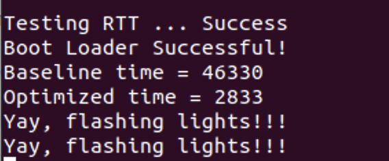

# 14642 Lab1

## Reflection
After walking through the whole lab, we gained deeper understanding for the optimization tricks like barrel shifter and loop unrolling etc. And the setting of this lab is also interesting enough for us to explore the logic of writing ARM Assembly code. 

The most impressed improvement was the moment we combine all the branch into one and finally worked out the logic behind it. The joy was beyond words! Watching the code be optimized from 51000 to 2800 also gave us a great sense of achivement. Besides the joy, we also learned the importance of code conciseness. There's a huge different between concise code and redundant code.

## Suggestion
This lab is very good in general, but it would be better if the write up can provide more detailed roadmap. So that we can get clear direction when we optimize the code instead of wondering what to do next. That would save us a lot of time exploring the code.

## Our result
