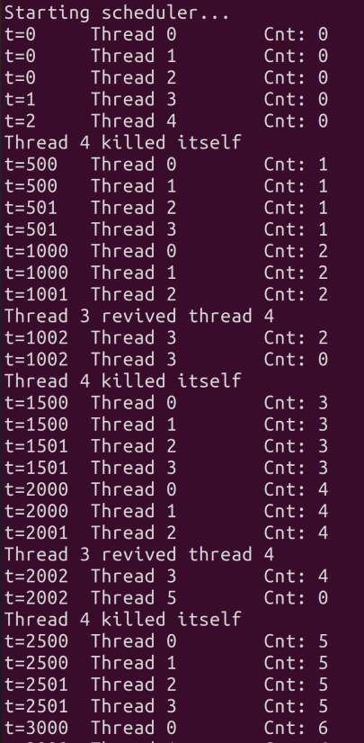

# Lab #4 - Get Real(-time Scheduled)!
## Team batmaneaters
### Team members:
Name: Ruobing Wang Andrew ID: ruobing2
Name: Xingzhi Wang Andrew ID: xingzhi2
## Lab Accomplishments:
In this lab, we accomplish these following tasks:
1. Context Switching
2. Rate-monotonic scheduling
3. Mutexes 
4. Priority Ceiling protocl
5. Memory Protection

## Tests:
This tasks have these following grade tests:
1. grade_RMS This test is a benchmark to verify your RMS implementation and the necessary syscalls. This
test will still mostly run without thread killing.
2. grade_revive - This test is a benchmark to test thread killing, revival, and memory protection.
3. grade_recursion - This test is a benchmark to verify memory protection and fault handling. You may
supply the recursion depth by adding the flag -n and specify stack size by adding the flag -s. For example,
make run USER_PROJ=grade_recursion USER_ARG="-n 200 -s 512".
4. grade_PCP – This test is a benchmark to verify your PCP implementation.

### Procedures for making Tests successful
#### grade_RMS
In order to make this one pass, please only leave 
```
return RMS_Scheduler_Highest(); 
```
from function uint32_t schedule_next() from file syscall_thread.c

And run:
```
make run USER_PROJ=grade_RMS
```
##### Result grade_rms


#### grade_revive && grade_recursion
In order to make this one pass, please only leave 
```
return RMS_Scheduler_Highest(); 
```
from function uint32_t schedule_next() from file syscall_thread.c

And run:
```
make run USER_PROJ=grade_revive
```
for grade_revive
##### Result grade_revive


Or run:
```
make run USER_PROJ=grade_recursion USER_ARG="-n 200 -s 512".
```
for grade_recursion
##### Result grade_recursion


#### grade_PCP
In order to make this one pass, please only leave 
```
return RMS_PCP_Scheduler(); 
```
from function uint32_t schedule_next() from file syscall_thread.c

And run:
```
make run USER_PROJ=grade_PCP
```
##### Result grade_PCP


## Thanks!
We have learned a lot from this lab. Thanks to Professor Patrick and Neel's help we finish this lab. 